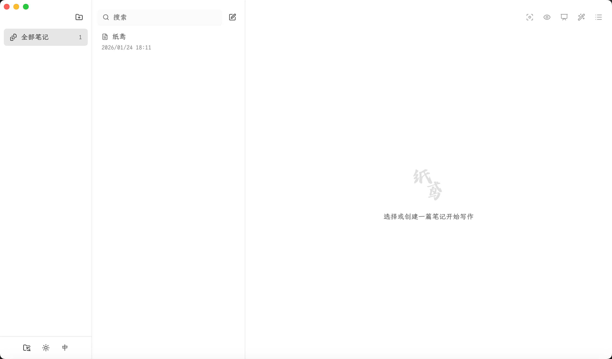
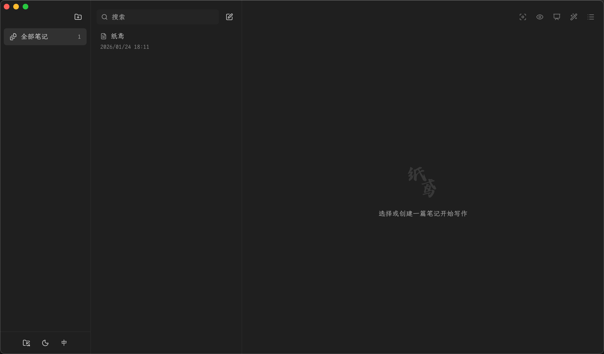

# 纸鸢

优雅的 Markdown 桌面编辑器

## ✨ 界面预览

### 深色主题



### 浅色主题



## 🎯 主要特性

### 📝 编辑器

- **CodeMirror 6 强力驱动** - 流畅的编辑体验
- **搜索与替换** - 支持查找、替换、全量替换，实时匹配计数
- **拖拽导入** - 直接拖放图片/文件到编辑器，自动生成 Markdown 语法
- **格式化** - 一键整理 Markdown 格式
- **专注模式** - 隐藏侧边栏，全屏专注写作

### 👁️ 预览与演示

- **实时预览** - 编辑/预览双栏模式，支持本地图片预览
- **智能目录** - 自动提取标题，点击跳转，滚动高亮当前位置
- **演示模式** - 全屏展示笔记，适合演讲和展示

### 📁 笔记管理

- **文件夹组织** - 灵活的笔记分类管理
- **笔记搜索** - 快速查找笔记
- **置顶功能** - 重要笔记置顶显示
- **多格式导出** - 支持导出为 HTML、PDF、图片、微信公众号格式

### 🎨 界面与体验

- **主题切换** - 深色/浅色主题，优雅的设计
- **流畅动画** - 基于 Framer Motion 的丝滑交互
- **跨平台** - 支持 Windows、macOS、Linux

## 📥 下载使用

前往 [Releases 页面](https://github.com/liwenka1/zhiyuan/releases) 下载最新版本：

- **macOS**: 下载 `.dmg` 文件
- **Windows**: 下载 `.exe` 文件
- **Linux**: 下载 `.AppImage` 或 `.deb` 文件

### macOS 用户注意事项

由于应用未经过 Apple 签名认证，首次打开时可能会提示"已损坏"。

**解决方法：**

1. 打开"终端"应用
2. 运行以下命令：
   ```bash
   xattr -cr /Applications/纸鸢.app
   ```
3. 再次打开应用即可正常使用

这是 macOS 对未签名应用的安全限制，属于正常现象。

## 🛠️ 技术栈

- Electron 38
- React 19
- TypeScript
- Tailwind CSS 4
- CodeMirror 6
- shadcn/ui

## 🚀 本地开发

```bash
# 安装依赖
pnpm install

# 启动开发模式
pnpm dev:desktop

# 构建应用
pnpm build:desktop
```

## 📄 License

MIT
